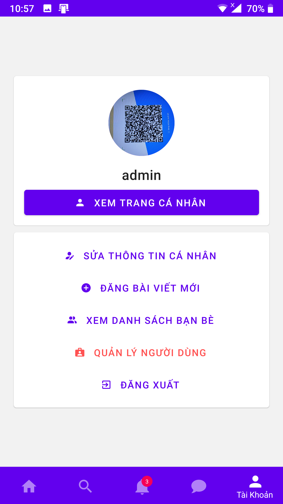

# Neshap - News Sharing App
Social Network Mobile App using React Native, NodeJS, and Neo4j

## Information
* Vietnamese language only
* App available for Android only
* Server requires Neo4j Graph Database

## Features
* **Account:** Register, Login, Logout, View Profile, Edit Profile.
* **Post:** List, View, Write, Edit, Delete, View by tag, Like, Unlike.
* **Comment:** Write, Delete.
* **Search:** for Post (by title or content), User (by name), Tag (literal).
* **Friend:** Add, Remove, Manage friend list. Friends can message each other.
* **Chat:** Real-time chat messages! View, Send and Delete.
* **Notification:** Receive when there are new likes, comments and friend requests.
* **Administrative:** View registered user and delete.

## Images
[View all images here!](./showcase)

